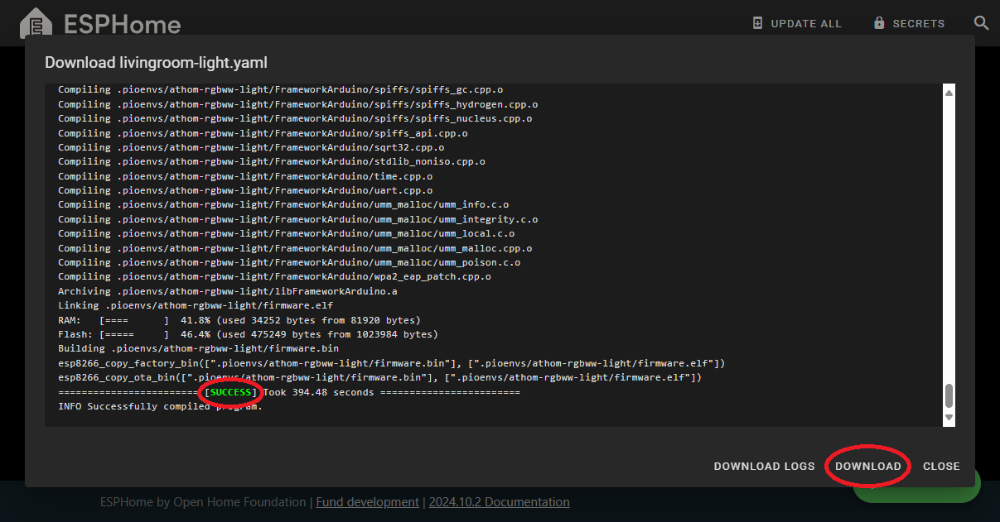

Beginner's Guide to Adding Devices
==================================

.. seo::
    :description: Adding Devices to ESPHome (For Beginners)
    :image: docker-mark-blue.svg

This guide is for people who are not so tech-orientated but wish to get their feet wet with ESPHome.

.. note::

    ESPHome devices usually rely on Home Assistant.  It's more than just an excellent way to control and automate your home.
    It can also manage many IoT devices.  Read more about `Home Assistant <https://www.home-assistant.io/>`__.

    If you are already running Home Assistant, check out :doc:`getting_started_hassio` to run ESPHome as an add-on.
    
    If running Home Assistant in Docker, get ESPHome by following instructions in the first part of :doc:`getting_started_command_line`.

    Or if not running Docker or Home Assistant at all, you can try :doc:`beginners_guide_docker_desktop`.

Setting up your Secrets
-----------------------

The first thing you should do is edit your ``Secrets`` file. This contains reusable elements that you can "hide" from the main ESPHome GUI.

Also, it allows you to copy and paste YAMLs from your own code to share with others (and vice versa) without the worry of leaking details about your home network.

Click here in the ESPHome Dashboard to edit ``Secrets``.

Wi-Fi Network
*************

Add the next 4 lines, replacing the placeholders with your own values.

.. code-block:: yaml

    # My Wi-Fi SSID and password
    wifi_ssid: "<MY_WIFI_NAME>"
    wifi_password: "<MY_WIFI_PASSWORD>"
    ap_password: "<MY_AP_PASSWORD>" # Super-secret!

These are the 3 most basic secrets. The wireless network name is set by ``wifi_ssid`` and the password is set by ``wifi_password``.
Actually, the names ``wifi_ssid``, ``wifi_password`` are arbitrary.  You could just as easily use ``home_wifi``, ``home_password`` if you like.
But ``wifi_ssid``, ``wifi_password``, and ``ap_password`` are commonly used in the community.

Finally, ``ap_password`` sets a password for the hotspot that an ESPHome device creates when it cannot find the wireless network.

.. note::

    Please note in the above example, I have included comments with the ``#`` character.  Comments can be added as their own lines or at the end of lines.
    Anything in the line after the ``#`` are ignored.  Often, comments can be used to explain what a particular section of code is doing.

.. warning::

    Although it is theoretically possible to use a 5Ghz or 6Ghz wireless network, there are not many ESP-based devices that actually support those ranges.
    Most known devices only support the 2.4Ghz range. In best practice, it is recommended that your wireless network frequencies have different names,
    for example, "MyWifi" for 2.4Ghz and "MyWifi5G" for 5Ghz.

OTA
***

.. code-block:: yaml

    ota_password: "<MY_OTA_PASSWORD>"

An ``ota_password`` is used to securely send Over-the-Air (OTA) updates from ESPHome to a device.
For beginners, it is a good idea to use the same password for all of your ESPHome devices.  This will ensure your updates are not broken by ESPHome's
default behavior of creating new passwords for every device.  You can make this password as long and complicated as you like because
you will not have to remember it.

MQTT
****

.. code-block:: yaml

    mqtt_broker: "192.168.1.150"
    mqtt_name: "mqttuser"
    mqtt_password: "mqttpassword"

These lines regard the MQTT (Message Queue Telemetry Transport) protocol.  MQTT is a lightweight, publish-subscribe-based messaging protocol that is
commonly used in IoT devices.  The ``mqtt_broker`` is the IP address of the MQTT server and the ``mqtt_name`` and ``mqtt_password`` are the username and password.
If you are not running an MQTT server, you do not need to add these to your secrets yet.

Save
****

Don't forget to click ``Save`` when finished editing.

Then you can close the Secrets.

Adding a Device
---------------

This example (and everything below) will use `Athom-E27-7W-Bulb <https://devices.esphome.io/devices/Athom-E27-7W-Bulb>`__ as an example
because it illustrates the basic principals of an ESPHome Configuration and the community's best practices. Your first use-case will
surely be different but the principles will be the same.

.. note::

    The YAML was referred to on November 4, 2024.  It may have changed since then.  It is important to know that ESPHome
    is constantly evolving, elements are always changing, and sometimes what you find by searching may not always be
    up-to-date for the latest version of ESPHome.  The community is always improving the documentation but there are often discrepancies.
    By the time you read this, it's possible some things here may be out-of-date.  It's always best to search
    :doc:`ESPHome.io </index>` if something is giving you trouble,
    the `Home Assistant forums <https://community.home-assistant.io/c/esphome/36>`__,
    ESPHome on `Discord <https://discord.com/invite/KhAMKrd>`__,
    or search the `Reddit sub <https://www.reddit.com/r/Esphome/>`__.

Adding the Device to ESPHome
****************************

First, click "New Device."  When you have no devices, it will look like this.

Give the device a name. For the example, let's call it "livingroom-light". The device name should be informative and unique because each and every device
in ESPHome will get it's own YAML file.  It's totally up to you how to name it.  After naming it, click "Next".

We're not ready to install ESPHome to the device yet so click "Skip this step".

Next, we have to choose what type of device this is. In the link for `Athom-E27-7W-Bulb <https://devices.esphome.io/devices/Athom-E27-7W-Bulb>`__
there is this snippet:

So we know it's an ESP8266.

You can see that ESPHome has generated a unique key for the device but we're not quite ready to install ESPHome yet, so click ``skip``.

Now we have a device YAML file ready.  But we still have to edit it to fit the device.

The YAML
********

Click ``edit``.

This is the ESPHome Dashboard editor. This is YAML code and how ESPHome devices are configured.

We need to go back to the profile for `Athom-E27-7W-Bulb <https://devices.esphome.io/devices/Athom-E27-7W-Bulb>`__.

Thankfully, this page has a button we can click "Copy" and just copy the entire YAML from the template.  Click "Copy".

Go back to the ESPHome Dashboard and use your mouse to move your cursor to the end of the file.
Create a marker like ``#-----`` (``#`` means it's a comment) and a few extra lines and make sure your cursor is at the first column like this.

And then paste what you just copied.

.. note::

    Hotkeys are very useful when working with plain text.  Get to know them and you will have an easier time with YAML files.

    .. tabs::

        .. tab:: Windows

            **Copy**  : ``Ctrl + C``

            **Paste** : ``Ctrl + V``

            **Cut**   : ``Ctrl + X``

            **Undo**  : ``Ctrl + Z``

            **Redo**  : ``Ctrl + Y``

        .. tab:: Linux

            **Copy**  : ``Ctrl + Shift + C``

            **Paste** : ``Ctrl + Shift + V``

            **Cut**   : ``Ctrl + Shift + X``

            **Undo**  : ``Ctrl + Z``

            **Redo**  : ``Ctrl + Shift + Y``

        .. tab:: MacOS

            **Copy**  : ``Command (⌘) + C``

            **Paste** : ``Command (⌘) + V``

            **Cut**   : ``Command (⌘) + X``

            **Undo**  : ``Command (⌘) + Z``

            **Redo**  : ``Command (⌘) + Shift + Z``

What we need to do now is merge the two separate bits together.  Fortunately, there isn't a lot to worry about.  Mostly, we will just work with what we pasted.

Throughout the rest of this tutorial, there will be links to more detailed documentation.  You can click on them to learn more.

substitutions:
^^^^^^^^^^^^^^

First, let's take a look at the very important :doc:`substitutions </components/substitutions>` section.

.. code-block:: yaml

    substitutions:
      device_name: "athom-rgbww-light"
      friendly_name: "Athom RGBWW Light"
      project_name: "athom.rgbww-light"
      project_version: "1.0"

This section is actually pretty short.  Some pre-made configurations will include a lot more.

What this does is set up a bunch of variables which are easy to edit, reusable, and individualize the device.
Perhaps you have two identical bulbs and you want to name them differently.  Just change it to something like this:

.. code-block:: yaml

    substitutions:
      device_name: "living-room-light"
      friendly_name: "Living Room Light"
      project_name: "athom.rgbww-light"
      project_version: "1.0"

Substitutions are incredible common among YAMLs you find online and they're almost always placed at the top.

  .. collapse:: The Order of Sections

      For almost every other section of a YAML, it's not strictly important what is higher or lower than another.
      It's useful to know that they are processed in order but sometimes you will see various sections in a much different arrangement
      than what we see here.  But almost always, ``substitutions`` is at the top and ``esphome`` is not far below.

esphome:
^^^^^^^^

Next, let's look at the ``esphome`` section and which is immediately after and see what the substitutions do.

.. code-block:: yaml

    esphome:
      name: "${device_name}"
      name_add_mac_suffix: true
      platform: ESP8266
      board: esp8285
      project:
        name: "${project_name}"
        version: "${project_version}"

Wherever you see a dollar-sign ``$`` followed by a variable name, it's a substitution.
In this way, we can easily change the name of the device and the project.
The ``device_name`` may also be needed later in the YAML and it could be pretty irritating to search every time you copy and paste a YAML for a new device.
In some cases, too, you may see hardware settings or other options defined in the substitutions section so that you don't have to search
for it to change it.

  .. collapse:: Note About Curly Brackets

      Note that usually curly brackets ``{$device_name}`` are usually used when calling the substitution, although sometimes you may see
      substitutions that do not use curly brackets like ``$device_name``.  Both are acceptable but curly brackets are used to avoid errors.

As for this ``esphome`` section.  There's not much reason to change anything, except maybe for ``name_add_mac_suffix: true``.
"What does that do?" you may be asking.  Let's check the documentation regarding :doc:`ESPHome Core Configuration </components/esphome>`.

It adds 3 digits from the hardware's MAC (the serial number of the Wireless interface).  It's useful when flashing multiple devices
with the same hardware and similar (but not the same) names.  Usually it's best to delete this line.

So, we should have this now:

.. code-block:: yaml

    esphome:
      name: "${device_name}"
      platform: ESP8266
      board: esp8285
      project:
        name: "${project_name}"
        version: "${project_version}"

api:
^^^^

Sometimes sections are blank but absolutely crucial they are present.  This next bit is one of them.

.. code-block:: yaml

    api:

This tells the device that it will be communicating with the :doc:`Home Assistant API </components/api>`.
If you are running Home Assistant, you need to keep this line, but go back above the ``#-----`` we made earlier and
and copy and paste the encryption key that was generated when the initial YAML was made, so we end up with something like:

.. code-block:: yaml

    api:
      encryption:
        key: "<YOUR_ENCRYPTION_KEY>"

If you don't have Home Assistant, you should just delete this section. If left in, the device will continuously
try to make a connection to Home Assistant and reboot every 15 minutes to re-attempt making the connection.

Also, you don't necessarily need encryption.  It just adds an additional layer of protection to your devices.

ota:
^^^^

.. code-block:: yaml

    ota:

This section is pretty important.  It allows :doc:`Over-the-Air Updates </components/ota/index>`.
Unless you want to make a physical connection to the device every time you want to update it, you should keep this section.

Unfortunately, it's incomplete.  As of 2024.6.0, ESPHome has changed the way OTA updates are specified.
As a bonus, we finally get to use one of the secrets we created earlier.

.. code-block:: yaml

    ota:
      - platform: esphome
        password: !secret ota_password

logger:
^^^^^^^

.. code-block:: yaml

    logger:

:doc:`Logging </components/logger>` is important.  Leave it in but if you find the messages overwhelming,
you can lower the level to only show errors (the default is DEBUG) with:

.. code-block:: yaml

    logger:
      level: ERROR

web_server:
^^^^^^^^^^^

.. code-block:: yaml

    web_server:
      port: 80

This section creates a :doc:`web server </components/web_server>`
on the device so you can access and control the device using the mDNS or IP address.
Chances are good that the web address will match what we made the `name:` earlier (which refers to the substitution `device-name`).
So after flashing the new firmware, we should be able to go to `http://living-room-light.local <http://living-room-light.local>`__ and control the light bulb.

.. collapse:: Note About mDNS

    mDNS (Multicast Domain Name System) is available on most networks. It allows devices to "declare" their name to the network,
    usually using the top-level domain `.local`. If mDNS is not functioning on your local network, it may be simpler
    to refer to the device's IP address instead.

wifi:
^^^^^

.. code-block:: yaml

    wifi:
      ssid: !secret wifi_ssid
      password: !secret wifi_password
      ap:

The :doc:`wifi </components/wifi>` section gives the device the name and password of the local wireless network
(as specified in the secrets).  The ``ap:`` part specifies that it will create a hotspot in case the device cannot connect to the network.
But let's edit that so the hotspot created will have the device's name as the hotspot name and the password as specified in the secrets file.

.. code-block:: yaml

    wifi:
      ssid: !secret wifi_ssid
      password: !secret wifi_password
      ap:
        ssid: ${device_name}
        password: !secret ap_password

captive_portal:
^^^^^^^^^^^^^^^

.. code-block:: yaml

    captive_portal:

The :doc:`captive_portal </components/captive_portal>` section is responsible to create a special web server using
the hotspot created in conjunction with the `ap:` information specified above.
This allows you allows you to give the device new wireless network credentials when the device cannot connect to the network it expects.

When you connect to the fallback hotspot, the web interface should open automatically or there should be a prompt on your phone to open
the login. If that does not work, you can also navigate to `http://192.168.4.1/ <http://192.168.4.1/>`__ manually in your browser.

Other Sections (Device Configuration)
^^^^^^^^^^^^^^^^^^^^^^^^^^^^^^^^^^^^^

The rest of the YAML specifies the various components that make the light bulb actually function.
Or, as in the case of ``text_sensor``, provide additional information.

In this example, they are:
:doc:`binary_sensor </components/binary_sensor/index>`,
:doc:`sensor </components/sensor/index>`,
:doc:`switch </components/switch/index>`,
:doc:`output </components/output/index>`,
:doc:`light </components/light/index>`, and
:doc:`text_sensor </components/text_sensor/index>`.

Of course, other devices may include other components.

  .. collapse:: The rest of the YAML (which you shouldn't need to edit)

      .. code-block:: yaml

          binary_sensor:
            - platform: status
              name: "${friendly_name} Status"
          
          sensor:
            - platform: uptime
              name: "${friendly_name} Uptime Sensor"
          
          switch:
            - platform: restart
              id: restart_switch
              name: "${friendly_name} Restart"
          
          output:
            - platform: esp8266_pwm
              id: red_output
              pin: GPIO4
            - platform: esp8266_pwm
              id: green_output
              pin: GPIO12
            - platform: esp8266_pwm
              id: blue_output
              pin: GPIO14
            - platform: esp8266_pwm
              id: warm_white_output
              pin: GPIO13
            - platform: esp8266_pwm
              id: white_output
              pin: GPIO5
          
          
          light:
            - platform: rgbww
              name: "${friendly_name}"
              red: red_output
              green: green_output
              blue: blue_output
              warm_white: warm_white_output
              cold_white: white_output
              cold_white_color_temperature: 6000 K
              warm_white_color_temperature: 3000 K
              color_interlock: true
          
          text_sensor:
            - platform: wifi_info
              ip_address:
                name: "${friendly_name} IP Address"
                disabled_by_default: true

.. note::

    When it comes to components, a YAML file can only have one section per component.
    For example, all switches must be listed under only one ``switch:`` heading.
    You can't have two separate ``switch:`` sections.

Finishing Up
^^^^^^^^^^^^

Now you can delete everything above and including the ``#-----`` so that the first line of your file should be ``substitutions``.

If you like you can make the first line of your file a comment you can refer to later.

Don't forget to save!

Then you can close the file.

Validate & Download Binary File
-------------------------------

On the living-room-light's YAML, click the three dots ``⋮`` and select ``Validate``.

If there are errors, read the message, then edit your YAML to fix the problem. You may need to search :doc:`ESPHome.io</index>` and do some reading.

If no errors, click ``Install``.

Even if we're not ready to actually install, ``Manual download`` will do a deeper check of the code to make sure everything is okay.

It can take a few minutes to download all the dependencies and compile the code, especially the first time.

.. figure:: images/noob_dashboard_4d.png
    :align: center
    :width: 95.0%
    :alt: ESPHome Dashboard showing compilation screen

If it doesn't say ``[ SUCCESS ]`` then you have to fix an error.  This may involve searching and reading the ESPHome documentation.

Otherwise, great!  You can download the binary and save it somewhere useful.  Actually you don't need to download it now.
Compilation next time will be much faster.

.. collapse:: Blocked Download

    There is a chance that some browsers (Brave Browser, for example) or an Antivirus program will block the download.
    If this happens, you may need to add an exception or override the block.

What's Next?
------------

Now you're ready to actually flash the device with your fresh ESPHome binary!

If you're lucky, the device already has ESPHome, you can actually just connect to it via web browser and upload your new binary file.
If your device already has :doc:`Tasmota <migrate_sonoff_tasmota>`, :doc:`ESPEasy <migrate_espeasy>`, or :doc:`ESPurna <migrate_espurna>`,
it's also pretty easy.

Harder, but possibly necessary, make a :doc:`physical connection to the device <physical_device_connection>`!

See Also
--------

- :doc:`ESPHome index </index>`
- :doc:`getting_started_hassio`
- :doc:`diy`
- :ghedit:`Edit`
