Beginner's Guide to Installing ESPHome on Docker Desktop
========================================================

.. seo::
    :description: Installing ESPHome On Docker Desktop (For Beginners)
    :image: docker-mark-blue.svg

This guide is for people who are not so tech-orientated but wish to get their feet wet with ESPHome.

Docker Desktop
--------------

Probably the easiest way to start with ESPHome, especially when you're not familiar with Home Assistant, is to start with Docker Desktop.

Docker Desktop can run Linux containers like ESPHome very well, although it may be slow on under-powered machines like "just for work" notebooks.

Running the command-line version of ESPHome might be enjoyable for the Linux-savvy but can be a headache, especially when it comes to Python and its dependencies.
The Docker version of ESPHome will take care of all the dependencies and make it a lot easier to at least get started with ESPHome.

Prepare Location for Docker and ESPHome Files
---------------------------------------------

You will need to make folders where Docker can use config files for ESPHome (and other containers).  This makes it painless to update the ESPHome container.

I recommend something easy to find.  The example below uses ``D:\Docker\esphome`` but anything easy to find will be good.

Install Docker Desktop
----------------------

Download and install the appropriate version of Docker Desktop from `the official site <https://www.docker.com/products/docker-desktop/>`__.
On Windows, this will also install any needed dependencies like WSL (Windows Subsystem for Linux).  On Mac, it will make sure you have
Apple Virtualization Framework.  You should accept any required other installs.

If you have installation issues, please refer to the docker documentation for
`Windows  <https://docs.docker.com/desktop/install/windows-install/>`__,
`Linux <https://docs.docker.com/desktop/install/linux/>`__, or
`Mac <https://docs.docker.com/desktop/install/mac-install/>`__.

Please note that although Docker Desktop is not particularly large, containers like ESPHome can be. And the compilation of ESPHome binaries
can take up a lot of space, too. You might be okay with 5GB free space but 10GB or more is highly recommended as a minimum since building
binaries can also take up space.

If Docker asks you to login, you can skip this.

Docker may also require a reboot to finalize the installation.

Add the ESPHome container
-------------------------

In Docker Desktop, you first to need to download the ESPHome image.  Click ``Images`` and then ``Search images to run``.

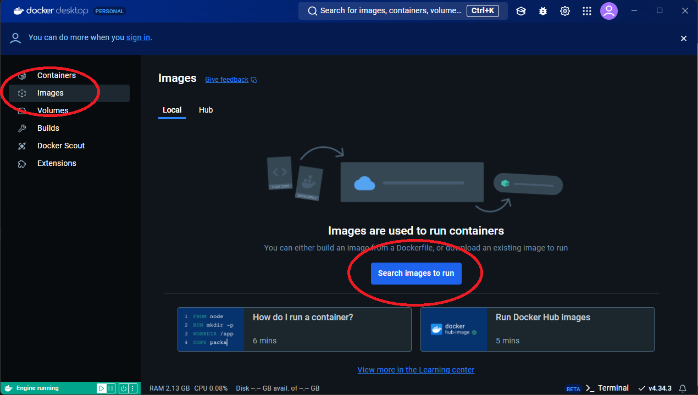

Type ``esphome`` in the search box.  The official ESPHome image belongs to the DockerHub member ``esphome`` so it should appear at the top as ``esphome/esphome``.

Next to that image, you can select the version but unless you have a specific problem, the ``latest`` is the best to use.  Click ``Pull`` to download the image.

It will take a few moments to download the image.

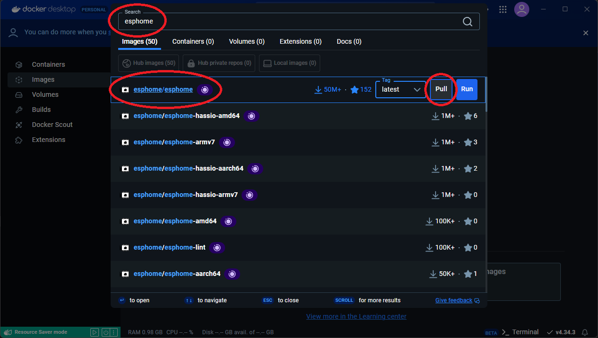

Click on ``Images`` again and it should now show that you have the image ``esphome/esphome`` ready to use.  Click the ``Run`` button.

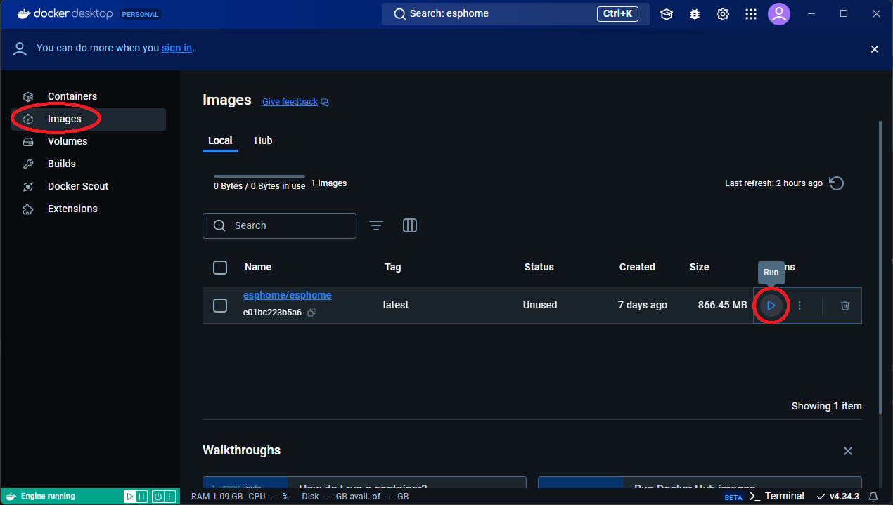

Before actually running, expand the optional settings. Give the container a name like ``esphome`` (you can use capital letters here if you like).
Also, set the port to use to access the GUI.  The default is ``6052``.
In the ``Volumes`` options, enter the locations ``Host path`` (set to the location created earlier) and ``Container path`` (Set to ``/config`` - it **MUST** be exactly like this).
Also, add an environment variable called ``TZ`` and set to your local timezone.  If you're not sure what yours is called, check
`Wikipedia <https://en.wikipedia.org/wiki/List_of_tz_database_time_zones>`_ under ``TZ identifier``.  Canonical-types are best.

After all that is done, click ``Run`` and the container will start.

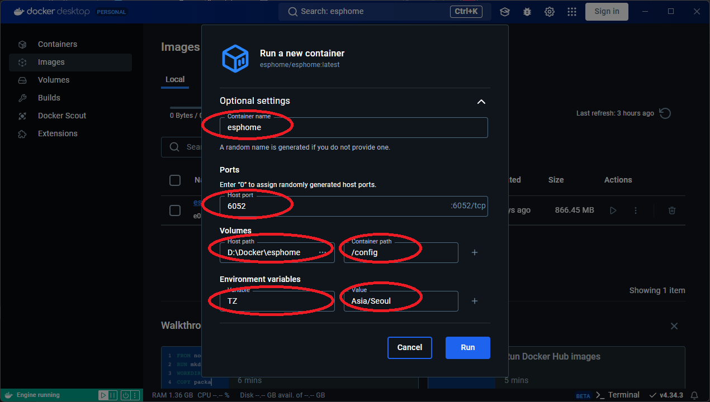

Windows may ask if Docker can access the network.  Click ``Allow``.

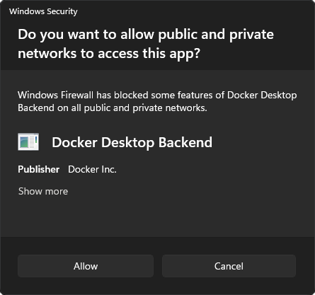

If your window looks like something like this, congratulations!  You are now running ESPHome on your computer!

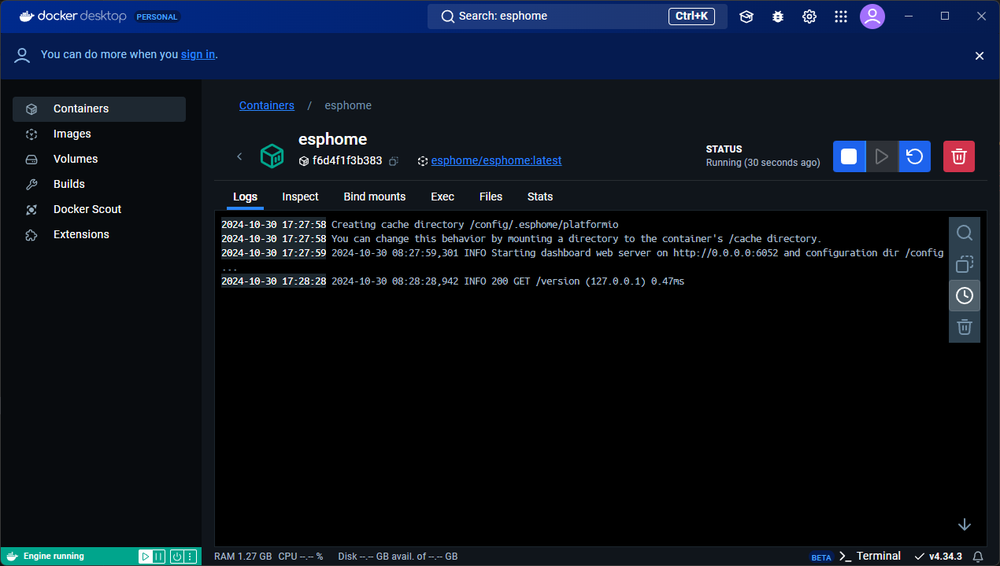

Go back to the Containers tab to manage the ESPHome container and ``Open with browser`` anytime the container is running.

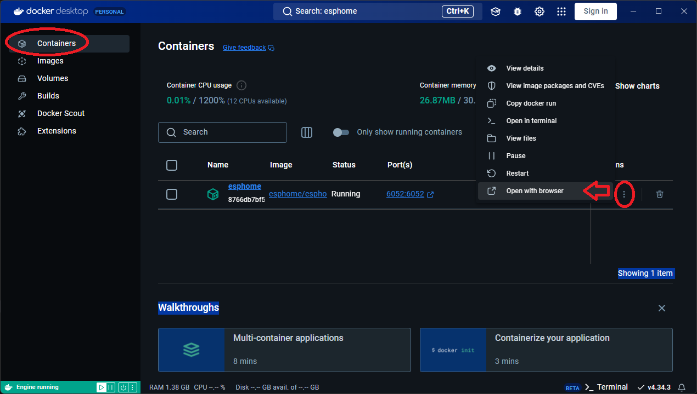

The gear in the top right corner allows you to manage Docker Desktop settings.  Docker usually is not set to start with Windows but you can change that if you like.

You can also update Docker Desktop itself by clicking on the gear and then clicking on ``Software updates``.

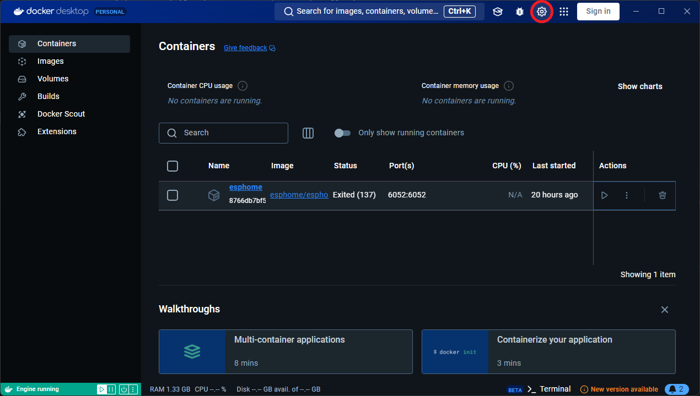

Also when starting Docker Desktop again, you may also need to run the container again using this screen.  When it is running the run ``▶`` icon will change to a stop ``⯀`` icon.

.. note::

    Also in this screen are options to stop and delete the container.  You **MUST** stop the container AND delete the container before updating the ESPHome image.

To update the ESPHome container (so you can run the latest version of ESPHome), click ``Settings`` then three dots ``⋮``,
and select ``Pull``.  Docker Desktop will check if there is a new ``latest`` image to pull. If there is, it will download it.
If not, it will tell you ``Image is up to date``.

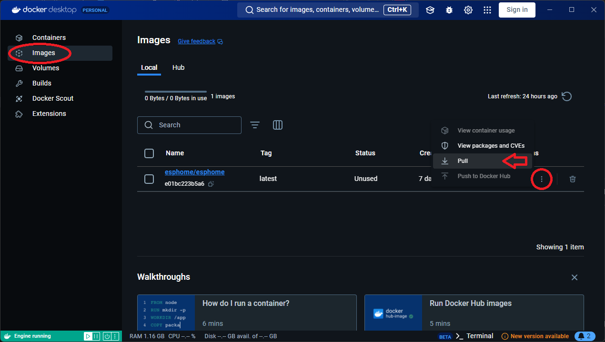

You will have to recreate the container as illustrated above.  As long as you you point to the correct folder with your ESPHome ``config`` files,
your configuration and all your device files will remain unchanged.

Automatically Update the ESPHome Container
******************************************

If you wish to automate the process (without deleting your esphome container or even stopping it), there's an easier way.

Search for images to add, enter ``adamus1red/ouroboros`` (the original is ``pyouroboros/ouroboros`` but it hasn't been updated in years),
``Pull`` the image, then ``Run`` with these options:

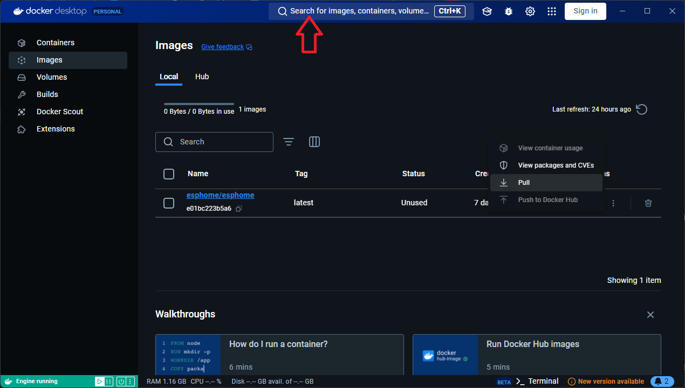

As before, we need to specify some optional settings.

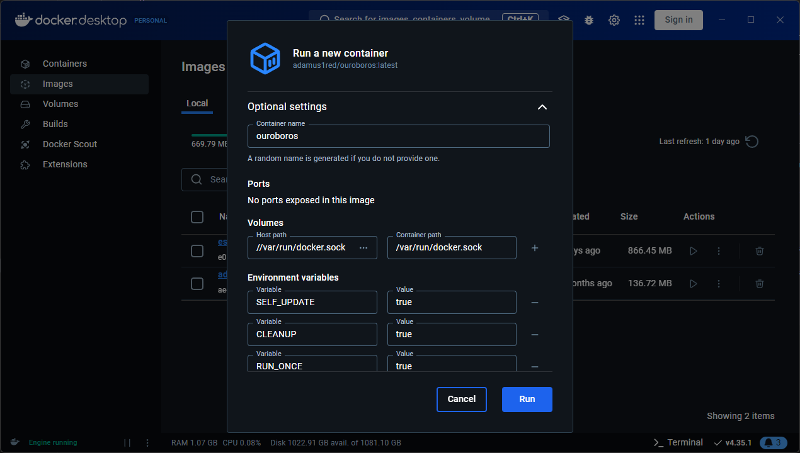

Because Ouroboros needs access to Docker's core, we should enter ``/var/run/docker.sock`` as the Container Path but where docker.sock resides
on your computer depends on the operating system you are using.

.. tabs::

    .. tab:: Windows

        Enter ``//var/run/docker.sock`` as the Host Path.

        *Note the double //.*

    .. tab:: Linux

        Enter ``/var/run/docker.sock`` as the Host Path.

        *This should work for most cases.*

    .. tab:: MacOS

        Enter ``/var/run/docker.sock`` as the Host Path.

        *The author does not have a Mac so this is untested.*

Also, set 4 environment variables (use the ``+`` to add more) ``SELF_UPDATE`` : ``true`` and ``CLEANUP`` : ``true`` and ``RUN_ONCE`` : ``true`` and ``LATEST`` : ``true``.

Now, to automatically update all containers, just run the ``ouroboros`` container.  It will automatically stop a container, pull the ``latest`` image,
and restart the container with your previous settings.  It will do this to all existing containers. Then, it will stop.

.. note::

    It is not actually best practice to perform updates automatically like this but it is a good way to automate the process if you are only running one container.

    You should probably check ESPHome's :doc:`Release Notes </changelog/index>` before, during, or after an update to see if there are any changes that affect your devices.

What's Next?
------------

Now you can add your :doc:`first ESPHome device <beginners_guide_adding_devices>`!

See Also
--------

- :doc:`ESPHome index </index>`
- :doc:`getting_started_hassio`
- :ghedit:`Edit`
